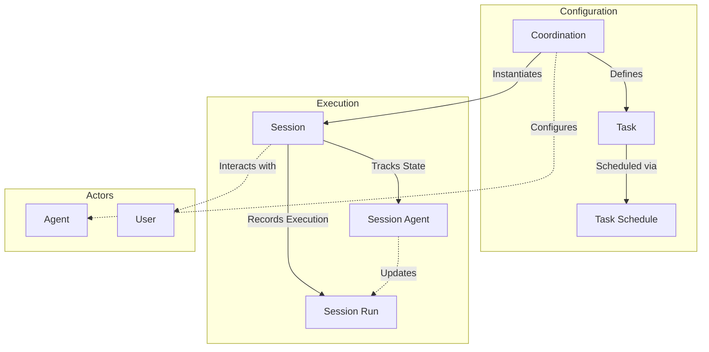
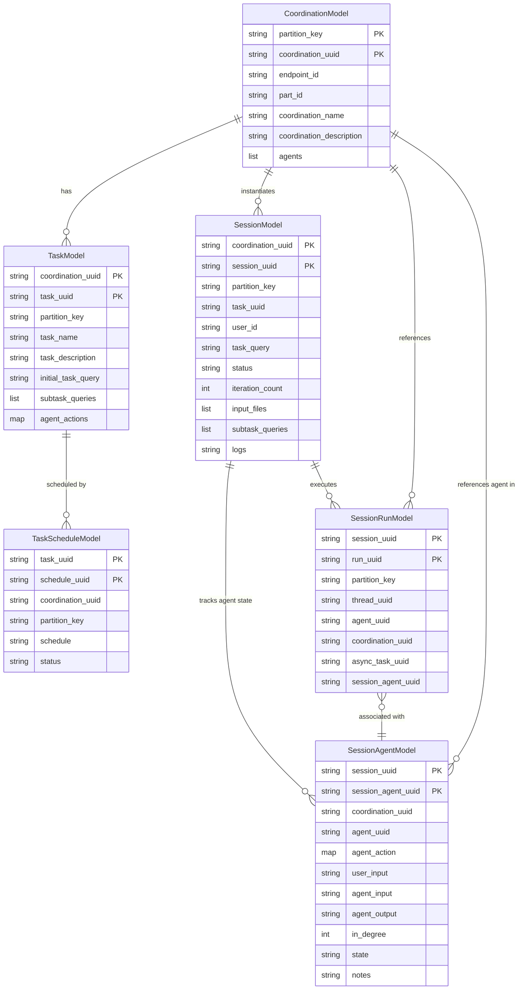

# AI Coordination Engine

The **AI Coordination Engine** is a modular system designed to orchestrate complex interactions between multiple AI agents, tasks, and sessions. It provides a robust framework for managing the lifecycle of AI-driven workflows, from defining coordination strategies to executing and tracking individual agent actions.

## Architecture Overview

The engine is built around the concept of **Coordinations**, which define the blueprint for how agents interact. **Sessions** are specific instances of these coordinations, where **Tasks** are executed. The system tracks the state of each agent within a session via **SessionAgents** and records every execution step in **SessionRuns**.

### High-Level Architecture



## Data Model Architecture

The core data models are designed to support scalable and traceable AI orchestration. The relationships between these models ensure that every action is linked back to its originating session and coordination context.

### Entity Relationship Diagram (ERD)



### 🔗 **Relationship Patterns**

#### **1. Orchestration Hierarchy** (Primary Workflow)

```
┌─────────────────────────────────────────────────────────────┐
│                  ORCHESTRATION HIERARCHY                     │
└─────────────────────────────────────────────────────────────┘

Coordination (Blueprint)
  │
  ├──> Task (1:N) ──> TaskSchedule (1:N)
  │
  └──> Session (1:N) ──┬──> SessionAgent (1:N) ──> Agent (Logical Reference)
                       │
                       └──> SessionRun (1:N) ──> Thread (Logical Reference)
```

**Cascade Delete Protection:**
- Cannot delete Coordination if Sessions or Tasks exist
- Cannot delete Session if SessionAgents or SessionRuns exist
- Cannot delete Task if TaskSchedules exist

**Key Fields:**
- Task references Coordination via: `coordination_uuid`
- Session references Coordination via: `coordination_uuid`
- SessionAgent references Session via: `session_uuid`
- SessionRun references Session via: `session_uuid`

---

#### **2. Execution State Tracking**

```
┌─────────────────────────────────────────────────────────────┐
│                  EXECUTION STATE TRACKING                    │
└─────────────────────────────────────────────────────────────┘

Session (Context Holder)
  │
  ├──> SessionAgent (1:N)
  │       │
  │       ├──> State (e.g., "initial", "in_progress")
  │       └──> In-Degree (Dependency Tracking)
  │
  └──> SessionRun (1:N)
          │
          ├──> Thread UUID (Conversation History)
          └──> Async Task UUID (Long-running Operations)
```

**Reference Patterns:**
- SessionAgent tracks the state of a specific `agent_uuid` within the Session.
- SessionRun records an immutable execution step, linking `run_uuid` to `thread_uuid`.
- Async operations are tracked via `async_task_uuid` on the SessionRun.
