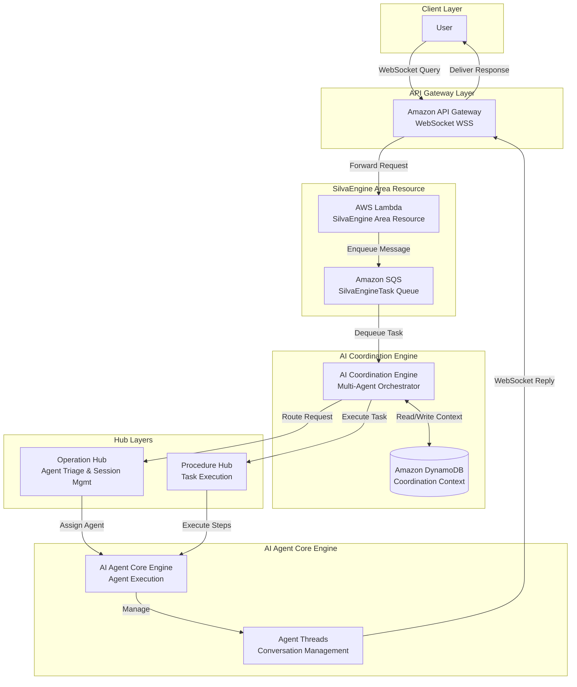
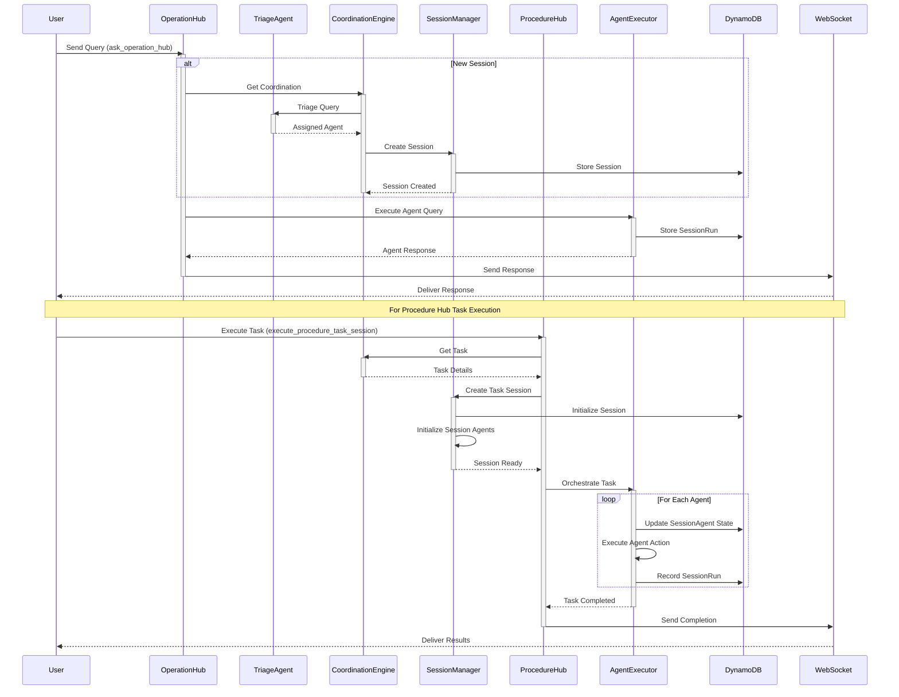
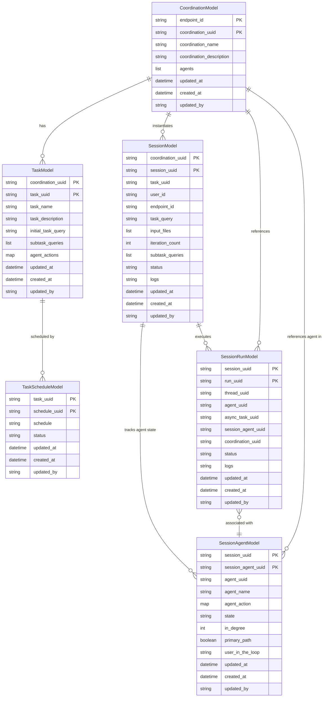
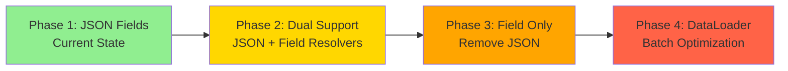

# AI Coordination Engine: Comprehensive Development Plan

> **Project Status**: 🟢 Production-Ready Core | 🟡 75% Complete | **Last Updated**: Dec 01, 2024
>
> **Quick Links**: [Current Status](#implementation-status) | [Roadmap](#development-roadmap) | [Architecture](#system-architecture)

## Executive Summary

The **AI Coordination Engine** is a sophisticated multi-agent orchestration platform built on AWS DynamoDB and the SilvaEngine serverless framework. The engine provides a comprehensive coordination system with GraphQL API for managing complex AI agent workflows through coordinations, tasks, sessions, and execution tracking. The platform enables intelligent agent triage, task decomposition, and session lifecycle management while maintaining clean separation of concerns.

### 📊 Project Progress Overview

```
Core Platform:        ████████████████████ 100% ✅ Complete
GraphQL API:          ████████████████████ 100% ✅ Complete
Multi-Agent System:   ███████████████████░  95% 🟡 Near Complete
Session Management:   ████████████████████ 100% ✅ Complete
Operation Hub:        ███████████████████░  95% 🟡 Near Complete
Procedure Hub:        ██████████████░░░░░░  70% 🟡 In Progress
Nested Resolvers:     ████████████░░░░░░░░  60% 🟡 In Progress
Batch Loading:        ░░░░░░░░░░░░░░░░░░░░   0% ⏳ Not Started
Testing Framework:    ████░░░░░░░░░░░░░░░░  20% 🟡 In Progress
Code Quality:         ░░░░░░░░░░░░░░░░░░░░   0% ⏳ Not Started
Documentation:        ████████░░░░░░░░░░░░  40% 🟡 Fair
──────────────────────────────────────────────────────
Overall Progress:     ███████████████░░░░░  75% 🟡 In Progress
```

### Core Architecture

**Technology Stack:**
- **GraphQL Server**: Graphene-based schema with strongly-typed resolvers
- **Database**: AWS DynamoDB with multi-tenant partitioning via `endpoint_id`
- **Lazy Loading**: Field-level resolvers for on-demand data fetching
- **Batch Optimization**: DataLoader pattern (planned) to eliminate N+1 queries
- **WebSocket**: Real-time bidirectional communication via API Gateway
- **Serverless**: AWS Lambda with SilvaEngine framework
- **Multi-Agent Orchestration**: Coordination-based agent workflow management
- **Session Tracking**: Complete lifecycle management with state tracking
- **Testing**: pytest framework (in progress)
- **Type Safety**: Python type hints throughout codebase

**Key Design Patterns:**
1. **Coordination-Based Architecture**: Agents orchestrated through coordination blueprints
2. **Session Lifecycle Management**: Complete tracking from creation to completion
3. **Multi-Agent Triage**: Intelligent agent assignment via LLM-based triage system
4. **Task Decomposition**: Breaking complex tasks into subtasks with dependencies
5. **Lazy Loading**: Nested entities resolved on-demand via GraphQL field resolvers
6. **Asynchronous Processing**: SQS-based task queue for non-blocking operations
7. **Multi-tenancy**: All models partition by `endpoint_id` for tenant isolation
8. **Audit Trail**: Comprehensive tracking via SessionRun and SessionAgent models
9. **Cascading Cache**: Hierarchical cache purging for data consistency

---

## Table of Contents

1. [System Architecture](#system-architecture)
2. [Data Model](#data-model)
3. [Implementation Status](#implementation-status)
4. [Development Roadmap](#development-roadmap)
5. [Performance Optimization](#performance-optimization)
6. [Testing Strategy](#testing-strategy)
7. [Deployment](#deployment)

---

## System Architecture

### High-Level Architecture



### Execution Flow



---

## Data Model

### ER Diagram Overview



### Model Inventory

The platform consists of **6 core models** organized into logical domains:

#### 1. Core Coordination Models

| Model | Table | Purpose | File | Status |
|-------|-------|---------|------|--------|
| **Coordination** | `ace-coordinations` | Multi-agent coordination blueprints | [coordination.py](../ai_coordination_engine/models/coordination.py) | ✅ Complete |
| **Task** | `ace-tasks` | Task definitions with agent actions | [task.py](../ai_coordination_engine/models/task.py) | ✅ Complete |
| **TaskSchedule** | `ace-task_schedules` | Scheduled task executions | [task_schedule.py](../ai_coordination_engine/models/task_schedule.py) | ✅ Complete |

#### 2. Session Management Models

| Model | Table | Purpose | File | Status |
|-------|-------|---------|------|--------|
| **Session** | `ace-sessions` | Active coordination sessions | [session.py](../ai_coordination_engine/models/session.py) | ✅ Complete |
| **SessionAgent** | `ace-session_agents` | Agent state within session | [session_agent.py](../ai_coordination_engine/models/session_agent.py) | ✅ Complete |
| **SessionRun** | `ace-session_runs` | Individual execution records | [session_run.py](../ai_coordination_engine/models/session_run.py) | ✅ Complete |

### Relationship Patterns

#### Hierarchical Orchestration Flow

```
┌─────────────────────────────────────────────────────────────┐
│                  ORCHESTRATION HIERARCHY                     │
└─────────────────────────────────────────────────────────────┘

Coordination (Blueprint)
  │
  ├──> Task (1:N) ──> TaskSchedule (1:N)
  │
  └──> Session (1:N) ──┬──> SessionAgent (1:N) ──> Agent (Logical Reference)
                       │
                       └──> SessionRun (1:N) ──> Thread (Logical Reference)
```

**Cascade Delete Protection:**
- Cannot delete Coordination if Sessions or Tasks exist
- Cannot delete Session if SessionAgents or SessionRuns exist
- Cannot delete Task if TaskSchedules exist

**Key Fields:**
- Task references Coordination via: `coordination_uuid`
- Session references Coordination via: `coordination_uuid`
- SessionAgent references Session via: `session_uuid`
- SessionRun references Session via: `session_uuid`

#### Execution State Tracking

```
┌─────────────────────────────────────────────────────────────┐
│                  EXECUTION STATE TRACKING                    │
└─────────────────────────────────────────────────────────────┘

Session (Context Holder)
  │
  ├──> SessionAgent (1:N)
  │       │
  │       ├──> State (e.g., "initial", "in_progress", "completed")
  │       ├──> In-Degree (Dependency Tracking)
  │       └──> Primary Path (Critical Path Indicator)
  │
  └──> SessionRun (1:N)
          │
          ├──> Thread UUID (Conversation History)
          └──> Async Task UUID (Long-running Operations)
```

**Reference Patterns:**
- SessionAgent tracks the state of a specific `agent_uuid` within the Session
- SessionRun records an immutable execution step, linking `run_uuid` to `thread_uuid`
- Async operations are tracked via `async_task_uuid` on the SessionRun

---

## Implementation Status

### 📊 Overall Progress: **75% Complete**

#### ✅ Completed Components (100%)

**Core Infrastructure** (✅ **COMPLETED** - 2024)
- [x] DynamoDB models for all 6 entities
- [x] GraphQL schema definition with strongly-typed resolvers
- [x] Query resolvers for all entities (7 query modules)
- [x] Mutation resolvers for all entities (8 mutation modules)
- [x] Type converters for all models (7 type modules)
- [x] WebSocket communication layer
- [x] SilvaEngine integration
- **Status**: ✅ Production-ready with 60+ Python files
- **Module Count**:
  - Models: 6 core models + 3 utility files
  - Types: 7 type modules
  - Queries: 7 query modules
  - Mutations: 8 mutation modules
  - Handlers: 12 handler files

**Coordination System** (✅ **COMPLETED** - 2024)
- [x] Coordination creation and management
- [x] Multi-agent configuration via agents list
- [x] Task definition with agent actions
- [x] Task scheduling system
- [x] Cascading cache purging
- **Status**: ✅ Complete coordination lifecycle management
- **Tables**: `ace-coordinations`, `ace-tasks`, `ace-task_schedules`

**Session Management** (✅ **COMPLETED** - 2024)
- [x] Session creation and lifecycle tracking
- [x] SessionAgent state management
- [x] SessionRun execution tracking
- [x] Session status tracking (initial, dispatched, in_progress, completed, failed)
- [x] User-session association via `user_id`
- [x] Input file handling
- [x] Subtask query management
- **Status**: ✅ Complete session lifecycle management
- **Tables**: `ace-sessions`, `ace-session_agents`, `ace-session_runs`

**Cache Infrastructure** (✅ **COMPLETED** - 2024)
- [x] Cascading cache purger implementation
- [x] Cache configuration system
- [x] Integration with `silvaengine_dynamodb_base.CascadingCachePurger`
- [x] Cache entity configuration for all 6 models
- [x] Cache relationship mappings
- **Status**: ✅ Production-ready cache management
- **Implementation**: [cache.py](../ai_coordination_engine/models/cache.py)

---

#### 🟡 In Progress (60-95%)

**Nested Resolver Architecture** (🟡 **IN PROGRESS** - 60% Complete)
- [x] GraphQL types with JSON fields for nested data
- [x] Model type converters return nested JSON structures
- [ ] Field resolvers for lazy-loading relationships (planned)
  - [ ] `SessionType.resolve_coordination` - Load full Coordination object
  - [ ] `SessionType.resolve_task` - Load full Task object
  - [ ] `SessionAgentType.resolve_session` - Load full Session object
  - [ ] `SessionRunType.resolve_session` - Load full Session object
  - [ ] `SessionRunType.resolve_session_agent` - Load full SessionAgent object
  - [ ] `SessionRunType.resolve_async_task` - Load full AsyncTask object
  - [ ] `TaskType.resolve_coordination` - Load full Coordination object
- [ ] Convert JSON fields to strongly-typed Field() definitions
- **Current Pattern**: JSON fields contain pre-fetched nested data
- **Target Pattern**: Field resolvers for on-demand lazy loading
- **Status**: 🟡 Currently using JSON, resolver migration planned
- **Next Step**: Implement lazy-loading field resolvers with type-safe objects

**Operation Hub** (🟡 **IN PROGRESS** - 95% Complete)
- [x] Operation hub query resolver (`ask_operation_hub`)
- [x] Triage agent system with LLM-based agent assignment
- [x] Session creation and management
- [x] Integration with AI Agent Core Engine
- [x] WebSocket response handling
- [x] Thread lifecycle management (`thread_life_minutes` support)
- [ ] Advanced error handling and retry logic
- [ ] Enhanced monitoring and metrics
- **Status**: 🟡 Core functionality complete, enhancements pending
- **Implementation**: [operation_hub.py](../ai_coordination_engine/handlers/operation_hub/operation_hub.py)

**Procedure Hub** (🟡 **IN PROGRESS** - 70% Complete)
- [x] Task session execution (`execute_procedure_task_session`)
- [x] Session agent initialization
- [x] In-degree calculation for dependency tracking
- [x] Agent action execution
- [x] User-in-the-loop support
- [x] Action function framework
- [ ] Complete task orchestration logic
- [ ] Subtask query decomposition
- [ ] Parallel agent execution optimization
- [ ] Enhanced state transition management
- **Status**: 🟡 Foundation complete, orchestration logic in progress
- **Implementation**: [procedure_hub.py](../ai_coordination_engine/handlers/procedure_hub/procedure_hub.py)

**Testing Infrastructure** (🟡 **IN PROGRESS** - 20% Complete)
- [x] Test file exists (`test_ai_coordination_engine.py`)
- [ ] Migrate to modern pytest framework
- [ ] Create external test data JSON file
- [ ] Implement parametrized tests
- [ ] Add module-scoped fixtures
- [ ] Create test helpers and utilities
- [ ] Add operation hub tests
- [ ] Add procedure hub tests
- [ ] Add cache management tests
- **Status**: 🟡 Basic tests exist, modernization needed
- **Target**: Modern pytest with >90% coverage

---

#### ⏳ Planned (0%)

**Batch Loading Optimization** (⏳ **PLANNED** - 0% Complete)
- [ ] Create `batch_loaders.py` module
- [ ] Implement DataLoader pattern with `promise` library
- [ ] Create model-specific loaders:
  - [ ] `CoordinationLoader` - Batch load coordinations by coordination_uuid
  - [ ] `TaskLoader` - Batch load tasks by task_uuid
  - [ ] `SessionLoader` - Batch load sessions by session_uuid
  - [ ] `SessionAgentLoader` - Batch load session agents by session_agent_uuid
  - [ ] `SessionRunLoader` - Batch load session runs by run_uuid
  - [ ] `TaskScheduleLoader` - Batch load task schedules by schedule_uuid
- [ ] Implement `RequestLoaders` container for per-request loader instances
- [ ] Integrate with HybridCacheEngine for cache-aware batching
- [ ] Update nested resolvers to use batch loaders
- [ ] Add batch loading for cross-entity queries (e.g., all sessions for coordination)
- **Status**: ⏳ Not started - Phase 2 priority
- **Expected Impact**: 70-85% reduction in DynamoDB queries for nested queries
- **Implementation Plan**:
  1. Create DataLoader instances for each model type
  2. Implement batch loading functions with cache integration
  3. Update field resolvers to use loaders instead of direct queries
  4. Add request-scoped loader context to GraphQL info object

**Advanced Features**
- [ ] Redis-backed caching for cross-request persistence
- [ ] Advanced query optimization
- [ ] Real-time monitoring dashboard
- [ ] Multi-region deployment support
- [ ] Performance benchmarking suite
- [ ] API documentation generation
- [ ] Client migration guides
- [ ] Agent performance analytics
- [ ] Session replay capabilities

**Code Quality & Infrastructure**
- [ ] Linting configuration (black, flake8, mypy)
- [ ] Pre-commit hooks
- [ ] Dependency pinning in `pyproject.toml`
- [ ] Security audit tooling
- [ ] CI/CD pipeline setup
- [ ] Automated testing in CI/CD
- [ ] Code coverage tracking

---

### 📈 Module Statistics

- **Total Python Files**: ~60
- **Core Models**: 6 (Coordination, Task, TaskSchedule, Session, SessionAgent, SessionRun)
- **GraphQL Types**: 7 type modules
- **Mutations**: 8 mutation modules (Insert/Update/Delete operations)
- **Queries**: 7 query modules (Single/List resolvers)
- **Test Files**: 1 (test_ai_coordination_engine.py)
- **Handlers**: 12 handler modules (Operation Hub, Procedure Hub, Config, Utility)

### 📊 Code Quality Status

| Aspect | Status | Notes |
|--------|--------|-------|
| Architecture | ✅ Excellent | Clean separation of concerns, coordination-based design |
| Performance | 🟡 Good | Needs optimization for parallel agent execution |
| Testing | 🟡 Fair | Basic tests exist, needs pytest migration |
| Documentation | 🟡 Good | README comprehensive, API docs needed |
| Type Safety | ✅ Good | Type hints throughout codebase |
| Caching | ✅ Good | Cascading cache infrastructure present |
| Error Handling | 🟡 Fair | Basic handling, needs enhancement |
| CI/CD | ⏳ Not Started | Manual testing only |

---

---

## Performance Optimization

### GraphQL Query Optimization Strategy

The AI Coordination Engine implements a multi-layered approach to optimize GraphQL query performance:

#### Current Implementation (JSON-Based Nested Data)

**Pattern:**
```python
class SessionType(ObjectType):
    coordination = JSON()  # Pre-fetched coordination data
    task = JSON()          # Pre-fetched task data
    session_uuid = String()
    # ... other fields
```

**Pros:**
- ✅ Simple implementation
- ✅ Single database query per session
- ✅ No N+1 query problem for basic queries

**Cons:**
- ❌ Always fetches nested data even when not requested
- ❌ No lazy loading capability
- ❌ Less type-safe (JSON instead of typed objects)
- ❌ Client cannot request specific nested fields

#### Target Implementation (Lazy-Loading Resolvers)

**Pattern:**
```python
class SessionType(ObjectType):
    coordination = Field(CoordinationType)  # Lazy-loaded via resolver
    task = Field(TaskType)                   # Lazy-loaded via resolver
    session_uuid = String()
    # ... other fields

    def resolve_coordination(self, info):
        # Only fetch if explicitly requested in query
        return coordination_loader.load(self.coordination_uuid)

    def resolve_task(self, info):
        # Only fetch if explicitly requested in query
        return task_loader.load(self.task_uuid)
```

**Benefits:**
- ✅ Fetch data only when explicitly requested
- ✅ Type-safe nested objects
- ✅ Fine-grained field selection
- ✅ Ready for DataLoader batch optimization

#### Future Implementation (DataLoader Batching)

**Pattern:**
```python
# Batch loader collects all coordination_uuids in the request
coordination_loader = DataLoader(batch_load_fn=batch_load_coordinations)

async def batch_load_coordinations(coordination_uuids):
    # Single batched query for all coordinations
    coordinations = await fetch_coordinations_by_uuids(coordination_uuids)
    return coordinations

# Usage in resolver
def resolve_coordination(self, info):
    return info.context.loaders.coordination_loader.load(self.coordination_uuid)
```

**Benefits:**
- ✅ Eliminates N+1 query problem
- ✅ Batches multiple individual requests
- ✅ Integrates with cache layer
- ✅ 70-85% reduction in database queries

### Cache Management Architecture

#### Cascading Cache Purging System

The engine implements a sophisticated cascading cache purge system to maintain data consistency:

```python
CACHE_ENTITY_CONFIG = {
    "coordination": {
        "children": ["task", "session"],
        "cache_keys": ["coordination_uuid"],
    },
    "session": {
        "children": ["session_agent", "session_run"],
        "parent": "coordination",
        "cache_keys": ["session_uuid", "coordination_uuid"],
    },
    "task": {
        "children": ["task_schedule"],
        "parent": "coordination",
        "cache_keys": ["task_uuid", "coordination_uuid"],
    },
    # ... additional entities
}
```

**Cache Hierarchy:**
```
Coordination
  ├──> Task
  │     └──> TaskSchedule
  └──> Session
        ├──> SessionAgent
        └──> SessionRun
```

**Purge Behavior:**
- Updating a **Coordination** purges its cache + all Tasks, Sessions, and their children
- Updating a **Session** purges its cache + all SessionAgents and SessionRuns
- Updating a **Task** purges its cache + all TaskSchedules
- Configurable cascade depth (default: 3 levels)

**Cache Integration Points:**
1. **Model-level caching**: `@method_cache` decorator on get functions
2. **Mutation decorators**: Automatic cache purging on insert/update/delete
3. **Manual purging**: `purge_entity_cascading_cache()` for custom scenarios
4. **TTL configuration**: Configurable via `Config.get_cache_ttl()`

### Performance Metrics & Targets

**Current Performance (JSON-Based):**
- Session query with nested data: ~150-250ms
- Coordination list query: ~200-350ms
- Database queries per request: 1-3

**Target Performance (With Lazy Loading + Batch Loading):**
- Session query (minimal fields): ~50-100ms
- Session query (with nested data): ~100-200ms
- Coordination list query (10 items): ~150-300ms
- Database queries per request: 1-2 (with batching)
- Cache hit rate: >80%

### Nested Resolver Migration Roadmap



**Phase Details:**

| Phase | Timeline | Status | Changes | Breaking |
|-------|----------|--------|---------|----------|
| **Phase 1** | Current | ✅ Complete | JSON fields only | N/A |
| **Phase 2** | Q1 2025 | ⏳ Planned | Add Field() + resolvers | No |
| **Phase 3** | Q2 2025 | ⏳ Planned | Remove JSON fields | Yes |
| **Phase 4** | Q3 2025 | ⏳ Planned | Add DataLoader | No |

**Example Migration:**

```python
# Phase 1 (Current)
class SessionType(ObjectType):
    coordination = JSON()  # Pre-fetched, always loaded

# Phase 2 (Dual Support)
class SessionType(ObjectType):
    coordination_json = JSON()  # Deprecated, for compatibility
    coordination = Field(CoordinationType)  # New, lazy-loaded

    def resolve_coordination(self, info):
        # Only fetch if requested
        return get_coordination_type(...)

# Phase 3 (Field Only)
class SessionType(ObjectType):
    coordination = Field(CoordinationType)  # Lazy-loaded

    def resolve_coordination(self, info):
        return get_coordination_type(...)

# Phase 4 (DataLoader)
class SessionType(ObjectType):
    coordination = Field(CoordinationType)  # Batch-loaded

    def resolve_coordination(self, info):
        # Uses DataLoader for batching
        return info.context.loaders.coordination.load(
            self.coordination_uuid
        )
```

---

## Development Roadmap

### Current Optimizations ✅

#### 1. Coordination-Based Architecture
- **Status:** ✅ Implemented
- **Impact:** Flexible multi-agent workflow management
- **Pattern:** Coordination blueprints define agent relationships and task flows

#### 2. Session Lifecycle Management
- **Status:** ✅ Implemented
- **Impact:** Complete tracking from creation to completion
- **Pattern:** Session → SessionAgent → SessionRun hierarchy

#### 3. Asynchronous Processing
- **Status:** ✅ Implemented
- **Impact:** Non-blocking task execution
- **Pattern:** SQS-based async task processing

#### 4. Cascading Cache Purging
- **Status:** ✅ Implemented
- **Impact:** Consistent cache invalidation across related entities
- **Pattern:** Hierarchical cache clearing based on entity relationships

### Planned Optimizations ⏳

#### 1. Nested Resolver Migration
- **Status:** ⏳ Planned (Phase 2)
- **Expected Impact:** On-demand data fetching, reduced unnecessary queries
- **Pattern:** Convert JSON fields to Field() with lazy-loading resolvers
- **Implementation Steps:**
  1. **Phase 1**: Add Field() definitions alongside existing JSON fields
     ```python
     class SessionType(ObjectType):
         coordination_json = JSON()  # Keep for backward compatibility
         coordination = Field(CoordinationType)  # New field resolver
     ```
  2. **Phase 2**: Implement field resolvers
     ```python
     def resolve_coordination(self, info):
         return get_coordination_type(info, get_coordination(
             self.endpoint_id, self.coordination_uuid
         ))
     ```
  3. **Phase 3**: Update clients to use new fields
  4. **Phase 4**: Remove deprecated JSON fields
- **Timeline:** 2-3 development cycles

#### 2. DataLoader Batch Optimization
- **Status:** ⏳ Planned (Phase 2/3)
- **Expected Impact:** 70-85% reduction in database queries
- **Pattern:** Implement DataLoader for batch + cache entity loading
- **Implementation Steps:**
  1. **Install dependencies**: Add `promise` library for DataLoader
  2. **Create batch_loaders.py**:
     ```python
     from promise import Promise
     from promise.dataloader import DataLoader

     class CoordinationLoader(DataLoader):
         def batch_load_fn(self, coordination_uuids):
             # Batch query all coordinations
             coordinations = batch_get_coordinations(coordination_uuids)
             return Promise.resolve(coordinations)
     ```
  3. **Add RequestLoaders container**:
     ```python
     class RequestLoaders:
         def __init__(self):
             self.coordination = CoordinationLoader()
             self.task = TaskLoader()
             self.session = SessionLoader()
             # ... other loaders
     ```
  4. **Integrate with GraphQL context**:
     ```python
     info.context['loaders'] = RequestLoaders()
     ```
  5. **Update resolvers to use loaders**:
     ```python
     def resolve_coordination(self, info):
         return info.context['loaders'].coordination.load(
             self.coordination_uuid
         )
     ```
- **Cache Integration**: Loaders check cache before database query
- **Timeline:** 3-4 development cycles after nested resolvers

#### 3. Parallel Agent Execution
- **Status:** ⏳ Planned (Phase 2)
- **Expected Impact:** 60-80% reduction in execution time for independent agents
- **Pattern:** Concurrent agent execution based on dependency graph (in-degree)

#### 2. Task Decomposition Enhancement
- **Status:** ⏳ Planned (Phase 2)
- **Expected Impact:** Better subtask generation and distribution
- **Pattern:** LLM-powered task analysis and subtask generation

#### 3. Request-Scoped Caching
- **Status:** ⏳ Planned (Phase 2)
- **Expected Impact:** Eliminate duplicate queries within same request
- **Pattern:** In-memory cache per GraphQL request

#### 4. Redis Caching Layer
- **Status:** ⏳ Planned (Phase 3)
- **Expected Impact:** Cross-request caching, reduced DynamoDB costs
- **Pattern:** TTL-based caching for frequently accessed data

#### 5. Agent Performance Analytics
- **Status:** ⏳ Planned (Phase 4)
- **Expected Impact:** Insights into agent efficiency and optimization opportunities
- **Pattern:** Metrics collection and analysis for SessionRun data

### Performance Metrics

**Target Metrics:**
- Query response time: < 300ms (p95)
- Session creation time: < 500ms (p95)
- WebSocket latency: < 100ms (p95)
- Database queries per request: < 10
- Cache hit rate: > 80%
- Agent triage accuracy: > 90%

---

## Testing Strategy

### Test Pyramid

```
                    ┌─────────────┐
                    │   E2E (5%)  │
                    │  5 tests    │
                    ├─────────────┤
                    │ Integration │
                    │   (25%)     │
                    │  15 tests   │
                    ├─────────────┤
                    │    Unit     │
                    │   (70%)     │
                    │  40 tests   │
                    └─────────────┘
```

### Test Markers

```python
pytest.mark.unit              # Unit tests (no external dependencies)
pytest.mark.integration       # Integration tests (DB, API)
pytest.mark.slow              # Tests taking significant time
pytest.mark.coordination      # Coordination-related tests
pytest.mark.session           # Session management tests
pytest.mark.task              # Task-related tests
pytest.mark.operation_hub     # Operation Hub tests
pytest.mark.procedure_hub     # Procedure Hub tests
pytest.mark.session_agent     # SessionAgent tests
pytest.mark.session_run       # SessionRun tests
pytest.mark.triage            # Agent triage tests
pytest.mark.nested_resolvers  # Nested GraphQL resolver tests
pytest.mark.batch_loading     # DataLoader batch loading tests
pytest.mark.cache             # Cache management tests
pytest.mark.performance       # Performance/benchmarking tests
pytest.mark.websocket         # WebSocket communication tests
```

### Running Tests

```bash
# Run all tests
pytest ai_coordination_engine/tests/ -v

# Run only unit tests
pytest ai_coordination_engine/tests/ -m unit

# Run only integration tests
pytest ai_coordination_engine/tests/ -m integration

# Run only operation hub tests
pytest ai_coordination_engine/tests/ -m operation_hub

# Run only nested resolver tests
pytest ai_coordination_engine/tests/ -m nested_resolvers

# Run only batch loading tests
pytest ai_coordination_engine/tests/ -m batch_loading

# Run only cache tests
pytest ai_coordination_engine/tests/ -m cache

# Run specific test function
pytest --test-function test_graphql_coordination_list

# Run nested resolver and batch loading tests together
pytest -m "nested_resolvers or batch_loading" -v

# Run with environment variable
export AI_COORDINATION_TEST_MARKERS="unit,integration"
pytest

# Run with coverage
pytest --cov=ai_coordination_engine --cov-report=html

# Run slow tests only
pytest -m slow -v

# Run multiple markers
pytest -m "coordination and integration" -v
```

### Test Coverage Goals

- **Overall Coverage:** >= 80%
- **Core Models:** >= 90%
- **Resolvers:** >= 85%
- **Handlers:** >= 75%
- **Utilities:** >= 90%

---

## Deployment

### Infrastructure

**AWS Services:**
- **Lambda:** Serverless compute for SilvaEngine
- **DynamoDB:** Primary data store (6 tables)
- **API Gateway:** WebSocket and REST API
- **SQS:** Asynchronous task queue
- **CloudWatch:** Logging and monitoring

**External Dependencies:**
- **AI Agent Core Engine:** Agent execution and thread management
- **LLM Services:** Triage agent and task decomposition

### Environment Configuration

**Required Environment Variables:**
```bash
# AWS Configuration
AWS_REGION=us-east-1
AWS_ACCESS_KEY_ID=<key>
AWS_SECRET_ACCESS_KEY=<secret>

# Endpoint Configuration
ENDPOINT_ID=<endpoint_id>
CONNECTION_ID=<connection_id>
EXECUTE_MODE=local|lambda

# Feature Flags
INITIALIZE_TABLES=0|1
```

### Deployment Process

1. **Build Package**
   ```bash
   python -m build
   ```

2. **Deploy to Lambda**
   ```bash
   # Using SilvaEngine deployment tools
   silvaengine deploy --environment production
   ```

3. **Initialize Tables** (first deployment only)
   ```bash
   INITIALIZE_TABLES=1 python -m ai_coordination_engine.main
   ```

4. **Verify Deployment**
   ```bash
   pytest ai_coordination_engine/tests/ -m integration
   ```

---

## Monitoring & Observability

### Key Metrics

**Performance Metrics:**
- Request latency (p50, p95, p99)
- Database query count per request
- Cache hit/miss ratio
- WebSocket connection duration
- Agent execution time
- Session lifecycle duration

**Business Metrics:**
- Active coordinations
- Active sessions
- Task executions per day
- Agent triage accuracy
- Average session duration
- SessionRuns per agent

**Error Metrics:**
- Error rate by endpoint
- Failed agent assignments
- Session failures
- Database errors
- WebSocket disconnections

### Logging

**Log Levels:**
- `DEBUG`: Detailed debugging information
- `INFO`: General informational messages
- `WARNING`: Warning messages
- `ERROR`: Error messages
- `CRITICAL`: Critical errors

**Log Format:**
```
%(asctime)s - %(name)s - %(levelname)s - %(message)s
```

**Key Log Points:**
- GraphQL query execution
- Database operations
- Agent triage decisions
- Session state transitions
- Task execution steps
- WebSocket events
- Error conditions
- Cache operations

### Observability Tools

**AWS CloudWatch:**
- Lambda function metrics
- DynamoDB table metrics
- API Gateway metrics
- SQS queue metrics
- Custom application metrics

**Recommended Dashboards:**
- Real-time session monitoring
- Agent performance tracking
- Coordination execution metrics
- Error tracking
- Cache efficiency

---

## Security

### Authentication & Authorization

- **API Gateway:** WebSocket authentication
- **IAM Roles:** Lambda execution roles with least privilege
- **Endpoint Isolation:** Multi-tenant via `endpoint_id`
- **Session Security:** User-session association via `user_id`

### Data Protection

- **Encryption at Rest:** DynamoDB encryption enabled
- **Encryption in Transit:** TLS 1.2+ for all communications
- **Session Data Isolation:** Per endpoint and user
- **Input File Security:** Secure handling of file uploads
- **Data Retention:** Configurable retention policies

### Security Best Practices

- Principle of least privilege for IAM roles
- Regular security audits
- Dependency vulnerability scanning
- API rate limiting
- Input validation and sanitization
- Secure WebSocket connections (WSS)
- Environment variable protection
- No hardcoded secrets in codebase

### Compliance Considerations

- GDPR compliance for session data
- Data residency requirements
- Audit trail maintenance
- Right to deletion support
- Data export capabilities

---

## Contributing

### Development Workflow

1. **Create Feature Branch**
   ```bash
   git checkout -b feature/your-feature-name
   ```

2. **Make Changes**
   - Follow code style guidelines
   - Add tests for new functionality
   - Update documentation
   - Ensure type hints are present

3. **Run Tests**
   ```bash
   pytest ai_coordination_engine/tests/ -v
   ```

4. **Submit Pull Request**
   - Describe changes clearly
   - Reference related issues
   - Ensure CI passes (when available)
   - Request review from maintainers

### Code Style

- **Python:** PEP 8
- **Line Length:** 88 characters (Black formatter)
- **Docstrings:** Google style
- **Type Hints:** Required for public APIs
- **Imports:** Organized (stdlib, third-party, local)

### Development Setup

```bash
# Clone repository
git clone https://github.com/ideabosque/ai_coordination_engine.git
cd ai_coordination_engine

# Create virtual environment
python -m venv venv
source venv/bin/activate  # On Windows: venv\Scripts\activate

# Install dependencies
pip install -e .
pip install -r requirements-dev.txt  # When available

# Set up environment variables
cp .env.example .env
# Edit .env with your configuration

# Run tests
pytest ai_coordination_engine/tests/ -v
```

### Testing Guidelines

- Write tests for all new features
- Maintain >= 80% code coverage
- Use pytest fixtures for common setup
- Add appropriate test markers
- Test both success and failure cases
- Include integration tests for complex features

### Documentation

- Update README.md for user-facing changes
- Update DEVELOPMENT_PLAN.md for architectural changes
- Add docstrings to all public functions/classes
- Include code examples where helpful
- Keep documentation in sync with code

---

## Appendix

### References

**Core Frameworks:**
- [SilvaEngine Documentation](https://github.com/ideabosque/silvaengine)
- [AI Agent Core Engine](https://github.com/ideabosque/ai_agent_core_engine)
- [GraphQL Best Practices](https://graphql.org/learn/best-practices/)
- [Graphene Python](https://docs.graphene-python.org/)

**Performance Optimization:**
- [DataLoader Pattern](https://github.com/graphql/dataloader)
- [DataLoader for Python](https://github.com/syrusakbary/aiodataloader)
- [Solving the N+1 Problem](https://www.apollographql.com/docs/apollo-server/data/resolvers/#solving-the-n1-problem)
- [GraphQL Query Complexity](https://shopify.engineering/rate-limiting-graphql-apis-calculating-query-complexity)

**Testing:**
- [Pytest Documentation](https://docs.pytest.org/)
- [Pytest Markers](https://docs.pytest.org/en/stable/how-to/mark.html)
- [GraphQL Testing Best Practices](https://www.apollographql.com/docs/apollo-server/testing/testing/)

### Glossary

**Core Concepts:**
- **Coordination:** Multi-agent orchestration blueprint defining agent relationships
- **Task:** Structured work definition with agent actions and dependencies
- **Session:** Active instance of a coordination execution
- **SessionAgent:** Agent state tracker within a session
- **SessionRun:** Individual execution record linking to threads and tasks
- **Operation Hub:** Entry point for user queries with agent triage
- **Procedure Hub:** Task execution engine with workflow orchestration
- **Triage Agent:** LLM-based agent assignment system
- **In-Degree:** Dependency count for agent execution ordering
- **Primary Path:** Critical path indicator for workflow optimization

**Performance Optimization Terms:**
- **Nested Resolver:** GraphQL resolver that fetches related entities on-demand
- **Lazy Loading:** Fetch data only when explicitly requested in query
- **DataLoader:** Batch loading and caching pattern for GraphQL
- **Batch Loading:** Collecting multiple individual requests into single batched query
- **N+1 Problem:** Performance issue where nested queries trigger many individual database calls
- **Cascading Cache:** Hierarchical cache purging system that clears related entity caches
- **Request-Scoped Cache:** In-memory cache valid for single GraphQL request
- **Field Resolver:** Function that resolves a specific field in GraphQL type

### Architecture Decisions

**Why Coordination-Based Design?**
- Enables flexible multi-agent workflows
- Supports complex agent dependencies
- Facilitates reusable agent configurations
- Allows for A/B testing of coordination strategies

**Why Session-Centric Tracking?**
- Complete lifecycle visibility
- Independent session isolation
- Scalable state management
- Audit trail for compliance

**Why Separate Operation and Procedure Hubs?**
- Operation Hub: User-facing, triage-focused
- Procedure Hub: Task-focused, workflow-oriented
- Clear separation of concerns
- Independent scaling and optimization

**Why Start with JSON Fields Instead of Nested Resolvers?**
- **Pragmatic Approach**: Faster initial implementation
- **No N+1 Problem**: Pre-fetching avoids multiple round trips
- **Backward Compatible**: Easy to migrate incrementally
- **Future-Proof**: Can add Field() resolvers alongside JSON fields
- **Trade-off**: Accepts some over-fetching for simplicity

**Migration Path to Nested Resolvers:**
1. **Phase 1** (Current): JSON fields with pre-fetched data
2. **Phase 2** (Next): Add Field() resolvers alongside JSON (dual support)
3. **Phase 3** (Future): Clients migrate to use Field() resolvers
4. **Phase 4** (Long-term): Remove JSON fields, add DataLoader batching

**Why DataLoader is Essential for Nested Resolvers?**
- **N+1 Problem Prevention**: Without DataLoader, nested resolvers create N+1 queries
- **Example Scenario**:
  ```graphql
  query {
    sessionList(limit: 10) {
      sessionList {
        sessionUuid
        coordination { coordinationName }  # Without DataLoader: 10 queries
        task { taskName }                   # Without DataLoader: 10 queries
      }
    }
  }
  ```
  - **Without DataLoader**: 1 (sessions) + 10 (coordinations) + 10 (tasks) = 21 queries
  - **With DataLoader**: 1 (sessions) + 1 (batch coordinations) + 1 (batch tasks) = 3 queries
- **Result**: 85% reduction in database queries

---

**Document Version:** 1.0
**Last Updated:** 2024-12-01
**Status:** Active Development
**Maintainer:** AI Coordination Engine Team
