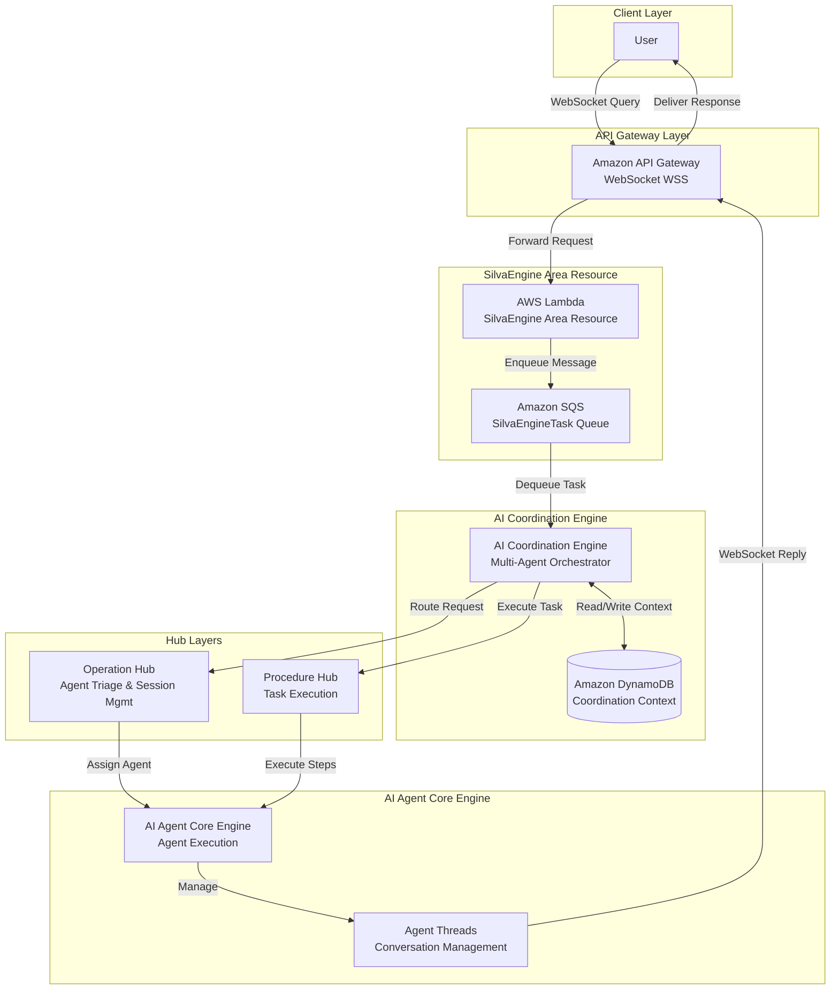
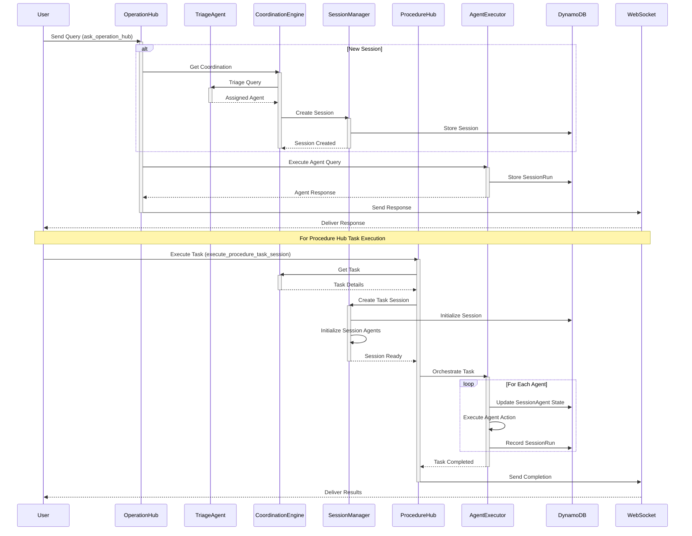
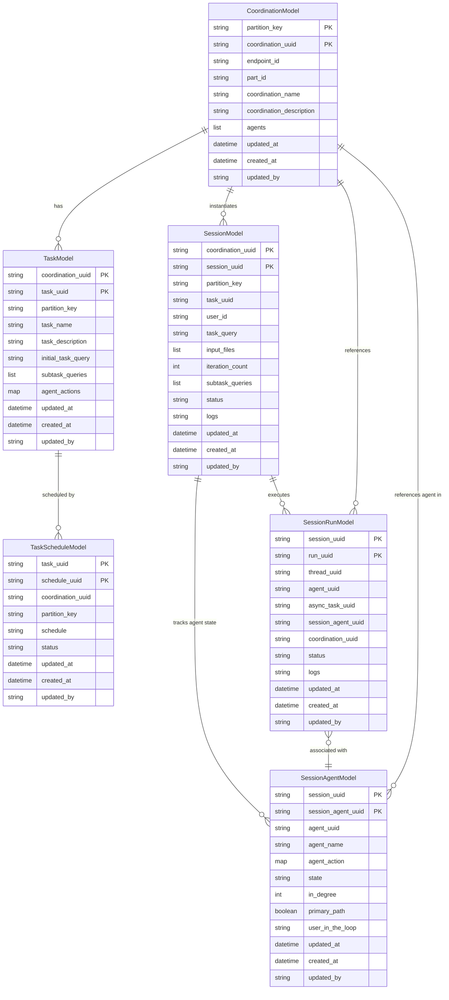
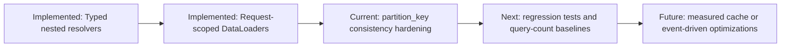

# AI Coordination Engine: Comprehensive Development Plan

> **Project Status**: Production-ready core | partition-key migration largely implemented | **Last Updated**: May 01, 2026
>
> **Quick Links**: [Current Status](#implementation-status) | [Roadmap](#development-roadmap) | [Architecture](#system-architecture)

## Executive Summary

The **AI Coordination Engine** is a sophisticated multi-agent orchestration platform built on AWS DynamoDB and the SilvaEngine serverless framework. The engine provides a comprehensive coordination system with GraphQL API for managing complex AI agent workflows through coordinations, tasks, sessions, and execution tracking. The platform enables intelligent agent triage, task decomposition, and session lifecycle management while maintaining clean separation of concerns.

### 📊 Project Progress Overview

```
Core Platform:        ████████████████████ 100% ✅ Complete
GraphQL API:          ████████████████████ 100% ✅ Complete
Multi-Agent System:   ███████████████████░  95% 🟡 Near Complete
Session Management:   ████████████████████ 100% ✅ Complete
Operation Hub:        ███████████████████░  95% 🟡 Near Complete
Procedure Hub:        ██████████████░░░░░░  70% 🟡 In Progress
Nested Resolvers:     ################....  80% Stabilizing
Batch Loading:        ################....  80% Implemented, needs consistency hardening
Testing Framework:    ████░░░░░░░░░░░░░░░░  20% 🟡 In Progress
Code Quality:         ░░░░░░░░░░░░░░░░░░░░   0% ⏳ Not Started
Documentation:        ████████░░░░░░░░░░░░  40% 🟡 Fair
──────────────────────────────────────────────────────
Overall Progress:     ███████████████░░░░░  75% 🟡 In Progress
```

### Core Architecture

**Technology Stack:**
- **GraphQL Server**: Graphene-based schema with strongly-typed resolvers
- **Database**: AWS DynamoDB with multi-tenant partitioning via composite `partition_key`
- **Lazy Loading**: Field-level resolvers for on-demand data fetching
- **Batch Optimization**: Request-scoped DataLoaders are implemented for nested resolver paths; remaining work is key-contract and cache-invalidation consistency
- **WebSocket**: Real-time bidirectional communication via API Gateway
- **Serverless**: AWS Lambda with SilvaEngine framework
- **Multi-Agent Orchestration**: Coordination-based agent workflow management
- **Session Tracking**: Complete lifecycle management with state tracking
- **Testing**: pytest framework (in progress)
- **Type Safety**: Python type hints throughout codebase

**Key Design Patterns:**
1. **Coordination-Based Architecture**: Agents orchestrated through coordination blueprints
2. **Session Lifecycle Management**: Complete tracking from creation to completion
3. **Multi-Agent Triage**: Intelligent agent assignment via LLM-based triage system
4. **Task Decomposition**: Breaking complex tasks into subtasks with dependencies
5. **Lazy Loading**: Nested entities resolved on-demand via GraphQL field resolvers
6. **Asynchronous Processing**: SQS-based task queue for non-blocking operations
7. **Multi-tenancy**: Coordination data is keyed by composite `partition_key = "{endpoint_id}#{part_id}"`; related models store `partition_key` where needed for tenant-scoped filtering and nested loading
8. **Audit Trail**: Comprehensive tracking via SessionRun and SessionAgent models
9. **Cascading Cache**: Hierarchical cache purging for data consistency

---

## Table of Contents

1. [System Architecture](#system-architecture)
2. [Data Model](#data-model)
3. [Implementation Status](#implementation-status)
4. [Development Roadmap](#development-roadmap)
5. [Performance Optimization](#performance-optimization)
6. [Testing Strategy](#testing-strategy)
7. [Deployment](#deployment)

---

## System Architecture

### High-Level Architecture


```mermaid
graph TB
    subgraph "Client Layer"
        User[User]
    end

    subgraph "API Gateway Layer"
        APIGW[Amazon API Gateway<br/>WebSocket WSS]
    end

    subgraph "SilvaEngine Area Resource"
        AreaLambda[AWS Lambda<br/>SilvaEngine Area Resource]
        SQS[Amazon SQS<br/>SilvaEngineTask Queue]
    end

    subgraph "AI Coordination Engine"
        CoordEngine[AI Coordination Engine<br/>Multi-Agent Orchestrator]
        DDB[(Amazon DynamoDB<br/>Coordination Context)]
    end

    subgraph "Hub Layers"
        OperationHub[Operation Hub<br/>Agent Triage & Session Mgmt]
        ProcedureHub[Procedure Hub<br/>Task Execution]
    end

    subgraph "AI Agent Core Engine"
        CoreEngine[AI Agent Core Engine<br/>Agent Execution]
        AgentThreads[Agent Threads<br/>Conversation Management]
    end

    User -->|WebSocket Query| APIGW
    APIGW -->|Forward Request| AreaLambda
    AreaLambda -->|Enqueue Message| SQS
    SQS -->|Dequeue Task| CoordEngine
    CoordEngine <-->|Read/Write Context| DDB
    CoordEngine -->|Route Request| OperationHub
    CoordEngine -->|Execute Task| ProcedureHub
    OperationHub -->|Assign Agent| CoreEngine
    ProcedureHub -->|Execute Steps| CoreEngine
    CoreEngine -->|Manage| AgentThreads
    AgentThreads -->|WebSocket Reply| APIGW
    APIGW -->|Deliver Response| User
```

### Execution Flow


```mermaid
sequenceDiagram
    participant User
    participant OperationHub
    participant TriageAgent
    participant CoordinationEngine
    participant SessionManager
    participant ProcedureHub
    participant AgentExecutor
    participant DynamoDB
    participant WebSocket

    User->>OperationHub: Send Query (ask_operation_hub)
    activate OperationHub

    alt New Session
        OperationHub->>CoordinationEngine: Get Coordination
        activate CoordinationEngine
        CoordinationEngine->>TriageAgent: Triage Query
        activate TriageAgent
        TriageAgent-->>CoordinationEngine: Assigned Agent
        deactivate TriageAgent
        CoordinationEngine->>SessionManager: Create Session
        activate SessionManager
        SessionManager->>DynamoDB: Store Session
        SessionManager-->>CoordinationEngine: Session Created
        deactivate SessionManager
        deactivate CoordinationEngine
    end

    OperationHub->>AgentExecutor: Execute Agent Query
    activate AgentExecutor
    AgentExecutor->>DynamoDB: Store SessionRun
    AgentExecutor-->>OperationHub: Agent Response
    deactivate AgentExecutor

    OperationHub->>WebSocket: Send Response
    deactivate OperationHub
    WebSocket-->>User: Deliver Response

    Note over User,WebSocket: For Procedure Hub Task Execution

    User->>ProcedureHub: Execute Task (execute_procedure_task_session)
    activate ProcedureHub
    ProcedureHub->>CoordinationEngine: Get Task
    activate CoordinationEngine
    CoordinationEngine-->>ProcedureHub: Task Details
    deactivate CoordinationEngine

    ProcedureHub->>SessionManager: Create Task Session
    activate SessionManager
    SessionManager->>DynamoDB: Initialize Session
    SessionManager->>SessionManager: Initialize Session Agents
    SessionManager-->>ProcedureHub: Session Ready
    deactivate SessionManager

    ProcedureHub->>AgentExecutor: Orchestrate Task
    activate AgentExecutor
    loop For Each Agent
        AgentExecutor->>DynamoDB: Update SessionAgent State
        AgentExecutor->>AgentExecutor: Execute Agent Action
        AgentExecutor->>DynamoDB: Record SessionRun
    end
    AgentExecutor-->>ProcedureHub: Task Completed
    deactivate AgentExecutor

    ProcedureHub->>WebSocket: Send Completion
    deactivate ProcedureHub
    WebSocket-->>User: Deliver Results
```

---

## Data Model

### ER Diagram Overview


```mermaid
erDiagram
    %% Core Coordination Flow
    CoordinationModel ||--o{ TaskModel : "has"
    CoordinationModel ||--o{ SessionModel : "instantiates"

    TaskModel ||--o{ TaskScheduleModel : "scheduled by"

    SessionModel ||--o{ SessionAgentModel : "tracks agent state"
    SessionModel ||--o{ SessionRunModel : "executes"

    SessionAgentModel }o--|| CoordinationModel : "references agent in"
    SessionRunModel }o--|| SessionAgentModel : "associated with"
    SessionRunModel }o--|| CoordinationModel : "references"

    CoordinationModel {
        string partition_key PK
        string coordination_uuid PK
        string endpoint_id
        string part_id
        string coordination_name
        string coordination_description
        list agents
        datetime updated_at
        datetime created_at
        string updated_by
    }

    TaskModel {
        string coordination_uuid PK
        string task_uuid PK
        string partition_key
        string task_name
        string task_description
        string initial_task_query
        list subtask_queries
        map agent_actions
        datetime updated_at
        datetime created_at
        string updated_by
    }

    TaskScheduleModel {
        string task_uuid PK
        string schedule_uuid PK
        string coordination_uuid
        string partition_key
        string schedule
        string status
        datetime updated_at
        datetime created_at
        string updated_by
    }

    SessionModel {
        string coordination_uuid PK
        string session_uuid PK
        string partition_key
        string task_uuid
        string user_id
        string task_query
        list input_files
        int iteration_count
        list subtask_queries
        string status
        string logs
        datetime updated_at
        datetime created_at
        string updated_by
    }

    SessionAgentModel {
        string session_uuid PK
        string session_agent_uuid PK
        string agent_uuid
        string agent_name
        map agent_action
        string state
        int in_degree
        boolean primary_path
        string user_in_the_loop
        datetime updated_at
        datetime created_at
        string updated_by
    }

    SessionRunModel {
        string session_uuid PK
        string run_uuid PK
        string thread_uuid
        string agent_uuid
        string async_task_uuid
        string session_agent_uuid
        string coordination_uuid
        string status
        string logs
        datetime updated_at
        datetime created_at
        string updated_by
    }
```

### Model Inventory

The platform consists of **6 core models** organized into logical domains:

#### 1. Core Coordination Models

| Model | Table | Purpose | File | Status |
|-------|-------|---------|------|--------|
| **Coordination** | `ace-coordinations` | Multi-agent coordination blueprints | [coordination.py](../ai_coordination_engine/models/coordination.py) | ✅ Complete |
| **Task** | `ace-tasks` | Task definitions with agent actions | [task.py](../ai_coordination_engine/models/task.py) | ✅ Complete |
| **TaskSchedule** | `ace-task_schedules` | Scheduled task executions | [task_schedule.py](../ai_coordination_engine/models/task_schedule.py) | ✅ Complete |

#### 2. Session Management Models

| Model | Table | Purpose | File | Status |
|-------|-------|---------|------|--------|
| **Session** | `ace-sessions` | Active coordination sessions | [session.py](../ai_coordination_engine/models/session.py) | ✅ Complete |
| **SessionAgent** | `ace-session_agents` | Agent state within session | [session_agent.py](../ai_coordination_engine/models/session_agent.py) | ✅ Complete |
| **SessionRun** | `ace-session_runs` | Individual execution records | [session_run.py](../ai_coordination_engine/models/session_run.py) | ✅ Complete |

### Relationship Patterns

#### Hierarchical Orchestration Flow

```
┌─────────────────────────────────────────────────────────────┐
│                  ORCHESTRATION HIERARCHY                     │
└─────────────────────────────────────────────────────────────┘

Coordination (Blueprint)
  │
  ├──> Task (1:N) ──> TaskSchedule (1:N)
  │
  └──> Session (1:N) ──┬──> SessionAgent (1:N) ──> Agent (Logical Reference)
                       │
                       └──> SessionRun (1:N) ──> Thread (Logical Reference)
```

**Cascade Delete Protection:**
- Cannot delete Coordination if Sessions or Tasks exist
- Cannot delete Session if SessionAgents or SessionRuns exist
- Cannot delete Task if TaskSchedules exist

**Key Fields:**
- Task references Coordination via: `coordination_uuid`
- Session references Coordination via: `coordination_uuid`
- SessionAgent references Session via: `session_uuid`
- SessionRun references Session via: `session_uuid`

#### Execution State Tracking

```
┌─────────────────────────────────────────────────────────────┐
│                  EXECUTION STATE TRACKING                    │
└─────────────────────────────────────────────────────────────┘

Session (Context Holder)
  │
  ├──> SessionAgent (1:N)
  │       │
  │       ├──> State (e.g., "initial", "in_progress", "completed")
  │       ├──> In-Degree (Dependency Tracking)
  │       └──> Primary Path (Critical Path Indicator)
  │
  └──> SessionRun (1:N)
          │
          ├──> Thread UUID (Conversation History)
          └──> Async Task UUID (Long-running Operations)
```

**Reference Patterns:**
- SessionAgent tracks the state of a specific `agent_uuid` within the Session
- SessionRun records an immutable execution step, linking `run_uuid` to `thread_uuid`
- Async operations are tracked via `async_task_uuid` on the SessionRun

---

## Implementation Status

### 📊 Overall Progress: **75% Complete**

#### ✅ Completed Components (100%)

**Core Infrastructure** (✅ **COMPLETED** - 2024)
- [x] DynamoDB models for all 6 entities
- [x] GraphQL schema definition with strongly-typed resolvers
- [x] Query resolvers for all entities (7 query modules)
- [x] Mutation resolvers for all entities (8 mutation modules)
- [x] Type converters for all models (7 type modules)
- [x] WebSocket communication layer
- [x] SilvaEngine integration
- **Status**: ✅ Production-ready with 60+ Python files
- **Module Count**:
  - Models: 6 core models + 3 utility files
  - Types: 7 type modules
  - Queries: 7 query modules
  - Mutations: 8 mutation modules
  - Handlers: 12 handler files

**Coordination System** (✅ **COMPLETED** - 2024)
- [x] Coordination creation and management
- [x] Multi-agent configuration via agents list
- [x] Task definition with agent actions
- [x] Task scheduling system
- [x] Cascading cache purging
- **Status**: ✅ Complete coordination lifecycle management
- **Tables**: `ace-coordinations`, `ace-tasks`, `ace-task_schedules`

**Session Management** (✅ **COMPLETED** - 2024)
- [x] Session creation and lifecycle tracking
- [x] SessionAgent state management
- [x] SessionRun execution tracking
- [x] Session status tracking (initial, dispatched, in_progress, completed, failed)
- [x] User-session association via `user_id`
- [x] Input file handling
- [x] Subtask query management
- **Status**: ✅ Complete session lifecycle management
- **Tables**: `ace-sessions`, `ace-session_agents`, `ace-session_runs`

**Cache Infrastructure** (✅ **COMPLETED** - 2024)
- [x] Cascading cache purger implementation
- [x] Cache configuration system
- [x] Integration with `silvaengine_dynamodb_base.CascadingCachePurger`
- [x] Cache entity configuration for all 6 models
- [x] Cache relationship mappings
- **Status**: ✅ Production-ready cache management
- **Implementation**: [cache.py](../ai_coordination_engine/models/cache.py)

---

#### 🟡 In Progress (60-95%)

**Nested Resolver Architecture** (IN PROGRESS - 80% Complete)
- [x] GraphQL types expose strongly typed nested fields for the main relationship paths
- [x] Field resolvers use request-scoped DataLoaders for coordination, task, session, session agent, session run, and async task lookups
- [x] DataLoader container is initialized lazily through `models.batch_loaders.get_loaders(info.context)`
- [x] Legacy JSON/dict helper paths remain available for listener and embedded-data flows
- [ ] Stabilize remaining helper paths that still use `endpoint_id` where a DataLoader expects `partition_key`
- [ ] Add focused tests for nested resolver and helper fallback paths using composite `partition_key` values
- **Current Pattern**: Typed field resolvers are implemented, with compatibility helpers for dict/JSON data in listener flows
- **Target Pattern**: All nested resolver and helper paths use the same key contract: `(partition_key, entity_uuid)` where applicable
- **Status**: Implemented but requires consistency hardening before being considered complete
- **Next Step**: Fix key-contract inconsistencies and add regression tests for partition-key propagation

**Operation Hub** (🟡 **IN PROGRESS** - 95% Complete)
- [x] Operation hub query resolver (`ask_operation_hub`)
- [x] Triage agent system with LLM-based agent assignment
- [x] Session creation and management
- [x] Integration with AI Agent Core Engine
- [x] WebSocket response handling
- [x] Thread lifecycle management (`thread_life_minutes` support)
- [ ] Advanced error handling and retry logic
- [ ] Enhanced monitoring and metrics
- **Status**: 🟡 Core functionality complete, enhancements pending
- **Implementation**: [operation_hub.py](../ai_coordination_engine/handlers/operation_hub/operation_hub.py)

**Procedure Hub** (🟡 **IN PROGRESS** - 70% Complete)
- [x] Task session execution (`execute_procedure_task_session`)
- [x] Session agent initialization
- [x] In-degree calculation for dependency tracking
- [x] Agent action execution
- [x] User-in-the-loop support
- [x] Action function framework
- [ ] Complete task orchestration logic
- [ ] Subtask query decomposition
- [ ] Parallel agent execution optimization
- [ ] Enhanced state transition management
- **Status**: 🟡 Foundation complete, orchestration logic in progress
- **Implementation**: [procedure_hub.py](../ai_coordination_engine/handlers/procedure_hub/procedure_hub.py)

**Testing Infrastructure** (🟡 **IN PROGRESS** - 20% Complete)
- [x] Test file exists (`test_ai_coordination_engine.py`)
- [ ] Migrate to modern pytest framework
- [ ] Create external test data JSON file
- [ ] Implement parametrized tests
- [ ] Add module-scoped fixtures
- [ ] Create test helpers and utilities
- [ ] Add operation hub tests
- [ ] Add procedure hub tests
- [ ] Add cache management tests
- **Status**: 🟡 Basic tests exist, modernization needed
- **Target**: Modern pytest with >90% coverage

---

#### Remaining Stabilization Work

**Batch Loading Optimization** (IMPLEMENTED - 80% Complete)
- [x] `models/batch_loaders/` package exists with model-specific loaders
- [x] `RequestLoaders` provides per-request DataLoader instances
- [x] Coordination, task, session, session agent, session run, session-agents-by-session, session-runs-by-session, and async-task loaders are present
- [x] Nested GraphQL type resolvers call loaders through `get_loaders(info.context)`
- [x] Loaders include cache-aware lookup behavior
- [ ] Align cache invalidation keys with loader keys, especially coordination cache invalidation using `partition_key` instead of `endpoint_id`
- [ ] Align helper fallback paths in `handlers/ai_coordination_utility.py` so loader calls use `(partition_key, uuid)` consistently
- [ ] Add tests that prove batched nested resolver paths do not fall back to old `(endpoint_id, uuid)` keys
- **Status**: Implemented for the main nested resolver paths; not yet complete because key-contract consistency gaps remain
- **Expected Impact**: Prevent N+1 query behavior for nested GraphQL selections while preserving request-local cache reuse
- **Primary Risk**: Mixed `endpoint_id` and `partition_key` cache/loader keys can cause missed cache invalidations or failed nested loads

**Advanced Features**
- [ ] Redis-backed caching for cross-request persistence
- [ ] Advanced query optimization
- [ ] Real-time monitoring dashboard
- [ ] Multi-region deployment support
- [ ] Performance benchmarking suite
- [ ] API documentation generation
- [ ] Client migration guides
- [ ] Agent performance analytics
- [ ] Session replay capabilities

**Code Quality & Infrastructure**
- [ ] Linting configuration (black, flake8, mypy)
- [ ] Pre-commit hooks
- [ ] Dependency pinning in `pyproject.toml`
- [ ] Security audit tooling
- [ ] CI/CD pipeline setup
- [ ] Automated testing in CI/CD
- [ ] Code coverage tracking

---

### 📈 Module Statistics

- **Total Python Files**: ~60
- **Core Models**: 6 (Coordination, Task, TaskSchedule, Session, SessionAgent, SessionRun)
- **GraphQL Types**: 7 type modules
- **Mutations**: 8 mutation modules (Insert/Update/Delete operations)
- **Queries**: 7 query modules (Single/List resolvers)
- **Test Files**: 1 (test_ai_coordination_engine.py)
- **Handlers**: 12 handler modules (Operation Hub, Procedure Hub, Config, Utility)

### 📊 Code Quality Status

| Aspect | Status | Notes |
|--------|--------|-------|
| Architecture | ✅ Excellent | Clean separation of concerns, coordination-based design |
| Performance | 🟡 Good | Needs optimization for parallel agent execution |
| Testing | 🟡 Fair | Basic tests exist, needs pytest migration |
| Documentation | 🟡 Good | README comprehensive, API docs needed |
| Type Safety | ✅ Good | Type hints throughout codebase |
| Caching | ✅ Good | Cascading cache infrastructure present |
| Error Handling | 🟡 Fair | Basic handling, needs enhancement |
| CI/CD | ⏳ Not Started | Manual testing only |

---

---

## Performance Optimization

### GraphQL Query Optimization Strategy

The current implementation uses typed GraphQL fields and request-scoped DataLoaders for the main nested resolver paths. The next optimization work is not to introduce DataLoader from scratch; it is to make every resolver, helper, and cache invalidation path obey the same key contract.

#### Current Implementation

**Pattern:**
```python
class SessionType(ObjectType):
    coordination = Field(CoordinationType)
    task = Field(TaskType)

    def resolve_coordination(parent, info):
        loaders = get_loaders(info.context)
        return loaders.coordination_loader.load(
            (parent.partition_key, parent.coordination_uuid)
        )
```

**Implemented:**
- Typed nested resolvers exist across session, task, task schedule, session agent, session run, operation hub, and procedure hub response types.
- `models/batch_loaders/` provides request-scoped DataLoaders through `RequestLoaders` and `get_loaders(info.context)`.
- Loader keys use composite IDs where needed, especially `(partition_key, coordination_uuid)` for coordination loading.
- Legacy dict/JSON helper functions remain for listener paths and pre-embedded nested data.

**Remaining Consistency Gaps:**
- `RequestLoaders.invalidate_cache()` still builds the coordination cache key from `endpoint_id`; it should use `partition_key` to match `CoordinationLoader`.
- `ensure_coordination_data()` still has a helper fallback that loads coordination with `(endpoint_id, coordination_uuid)`; it should use `(partition_key, coordination_uuid)`.
- `_load_task_from_loader()` uses `(coordination_uuid, task_uuid)` while the task loader contract should be checked and documented against current model keys.
- Batch helper maps currently key results by UUID only; if the same UUID can exist under multiple `partition_key` values, result maps should use composite keys.

**Near-Term Target:**
- Keep the typed resolver and DataLoader design.
- Standardize all loader and cache keys.
- Add regression tests for nested resolver paths under at least two different `partition_key` values.
- Measure query counts and cache hit/miss behavior before adding new cache layers.

### Partition Key Architecture

`partition_key` is the authoritative tenant boundary for coordination-scoped reads and writes. It is assembled once in `AICoordinationEngine._apply_partition_defaults()` from `endpoint_id` and `part_id` and then passed through GraphQL context.

```python
partition_key = f"{endpoint_id}#{part_id}"
```

Rules:
- Use `partition_key` for coordination hash-key access.
- Keep `endpoint_id` and `part_id` as denormalized attributes for compatibility, filtering, and operational visibility.
- Do not pass `endpoint_id` to a loader that expects `partition_key`.
- Cache keys for coordination-scoped entities must include `partition_key`, not just `endpoint_id` or entity UUID.

### Cache Management Architecture

#### Cascading Cache Purging System

The engine implements a sophisticated cascading cache purge system to maintain data consistency:

```python
CACHE_ENTITY_CONFIG = {
    "coordination": {
        "children": ["task", "session"],
        "cache_keys": ["coordination_uuid"],
    },
    "session": {
        "children": ["session_agent", "session_run"],
        "parent": "coordination",
        "cache_keys": ["session_uuid", "coordination_uuid"],
    },
    "task": {
        "children": ["task_schedule"],
        "parent": "coordination",
        "cache_keys": ["task_uuid", "coordination_uuid"],
    },
    # ... additional entities
}
```

**Cache Hierarchy:**
```
Coordination
  ├──> Task
  │     └──> TaskSchedule
  └──> Session
        ├──> SessionAgent
        └──> SessionRun
```

**Purge Behavior:**
- Updating a **Coordination** purges its cache + all Tasks, Sessions, and their children
- Updating a **Session** purges its cache + all SessionAgents and SessionRuns
- Updating a **Task** purges its cache + all TaskSchedules
- Configurable cascade depth (default: 3 levels)

**Cache Integration Points:**
1. **Model-level caching**: `@method_cache` decorator on get functions
2. **Mutation decorators**: Automatic cache purging on insert/update/delete
3. **Manual purging**: `purge_entity_cascading_cache()` for custom scenarios
4. **TTL configuration**: Configurable via `Config.get_cache_ttl()`

### Performance Metrics & Targets

**Current Performance (JSON-Based):**
- Session query with nested data: ~150-250ms
- Coordination list query: ~200-350ms
- Database queries per request: 1-3

**Target Performance (With Lazy Loading + Batch Loading):**
- Session query (minimal fields): ~50-100ms
- Session query (with nested data): ~100-200ms
- Coordination list query (10 items): ~150-300ms
- Database queries per request: 1-2 (with batching)
- Cache hit rate: >80%

### Nested Resolver and DataLoader Stabilization Roadmap


```mermaid
graph LR
    A[Implemented: Typed nested resolvers] --> B[Implemented: Request-scoped DataLoaders]
    B --> C[Current: partition_key consistency hardening]
    C --> D[Next: regression tests and query-count baselines]
    D --> E[Future: measured cache or event-driven optimizations]
```

**Current Phase Details:**

| Phase | Status | Changes | Breaking |
|-------|--------|---------|----------|
| Typed nested resolvers | Implemented | GraphQL types expose nested fields for related entities | No |
| Request-scoped DataLoaders | Implemented | `RequestLoaders` and model-specific loaders batch nested loads | No |
| Partition-key consistency | In progress | Align every loader/cache/helper key to `partition_key` contracts | No |
| Regression tests | Pending | Add multi-tenant nested resolver and cache invalidation tests | No |
| Additional caching | Pending measurement | Add only after cache hit rates and query counts justify it | No |

**Resolver Key Pattern:**

```python
def resolve_coordination(parent, info):
    loaders = get_loaders(info.context)
    partition_key = getattr(parent, "partition_key", None) or info.context.get("partition_key")
    return loaders.coordination_loader.load((partition_key, parent.coordination_uuid))
```

**Stabilization Rule:** Any code path that loads coordination data must use `partition_key`, not `endpoint_id`, as the first part of the loader/cache key.

---

## Development Roadmap

### Current Optimizations ✅

#### 1. Coordination-Based Architecture
- **Status:** ✅ Implemented
- **Impact:** Flexible multi-agent workflow management
- **Pattern:** Coordination blueprints define agent relationships and task flows

#### 2. Session Lifecycle Management
- **Status:** ✅ Implemented
- **Impact:** Complete tracking from creation to completion
- **Pattern:** Session → SessionAgent → SessionRun hierarchy

#### 3. Asynchronous Processing
- **Status:** ✅ Implemented
- **Impact:** Non-blocking task execution
- **Pattern:** SQS-based async task processing

#### 4. Cascading Cache Purging
- **Status:** ✅ Implemented
- **Impact:** Consistent cache invalidation across related entities
- **Pattern:** Hierarchical cache clearing based on entity relationships

### Planned Optimizations ⏳

#### 1. Partition-Key and DataLoader Consistency Hardening
- **Status:** In progress
- **Expected Impact:** Correct tenant isolation, reliable nested resolver behavior, and predictable cache invalidation
- **Pattern:** Use `partition_key` consistently for coordination-scoped loader and cache keys
- **Implementation Steps:**
  1. Update coordination cache invalidation to use `partition_key`.
  2. Update `ensure_coordination_data()` and related helpers to call loaders with `(partition_key, uuid)`.
  3. Audit task/session helper loader keys against each loader class contract.
  4. Add tests with two `part_id` values under the same `endpoint_id` to catch tenant leakage.
  5. Record query-count and cache-hit baselines before introducing new cache layers.
- **Timeline:** Immediate stabilization work before further optimization

#### 2. Nested Resolver Coverage Completion
- **Status:** Implemented for main paths; pending regression coverage
- **Expected Impact:** Safer typed GraphQL relationships without N+1 regressions
- **Pattern:** Keep typed field resolvers backed by request-scoped DataLoaders
- **Implementation Steps:**
  1. Add unit tests for session -> coordination/task.
  2. Add unit tests for session run -> session/session agent/async task.
  3. Add integration tests that verify nested selections work with composite `partition_key`.
  4. Preserve compatibility helper behavior for async listener flows that receive embedded dicts.
- **Timeline:** Same cycle as key consistency hardening

#### 3. Parallel Agent Execution
- **Status:** ⏳ Planned (Phase 2)
- **Expected Impact:** 60-80% reduction in execution time for independent agents
- **Pattern:** Concurrent agent execution based on dependency graph (in-degree)

#### 2. Task Decomposition Enhancement
- **Status:** ⏳ Planned (Phase 2)
- **Expected Impact:** Better subtask generation and distribution
- **Pattern:** LLM-powered task analysis and subtask generation

#### 3. Request-Scoped Caching
- **Status:** ⏳ Planned (Phase 2)
- **Expected Impact:** Eliminate duplicate queries within same request
- **Pattern:** In-memory cache per GraphQL request

#### 4. Redis Caching Layer
- **Status:** ⏳ Planned (Phase 3)
- **Expected Impact:** Cross-request caching, reduced DynamoDB costs
- **Pattern:** TTL-based caching for frequently accessed data

#### 5. Agent Performance Analytics
- **Status:** ⏳ Planned (Phase 4)
- **Expected Impact:** Insights into agent efficiency and optimization opportunities
- **Pattern:** Metrics collection and analysis for SessionRun data

### Performance Metrics

**Target Metrics:**
- Query response time: < 300ms (p95)
- Session creation time: < 500ms (p95)
- WebSocket latency: < 100ms (p95)
- Database queries per request: < 10
- Cache hit rate: > 80%
- Agent triage accuracy: > 90%

---

## Testing Strategy

### Test Pyramid

```
                    ┌─────────────┐
                    │   E2E (5%)  │
                    │  5 tests    │
                    ├─────────────┤
                    │ Integration │
                    │   (25%)     │
                    │  15 tests   │
                    ├─────────────┤
                    │    Unit     │
                    │   (70%)     │
                    │  40 tests   │
                    └─────────────┘
```

### Test Markers

```python
pytest.mark.unit              # Unit tests (no external dependencies)
pytest.mark.integration       # Integration tests (DB, API)
pytest.mark.slow              # Tests taking significant time
pytest.mark.coordination      # Coordination-related tests
pytest.mark.session           # Session management tests
pytest.mark.task              # Task-related tests
pytest.mark.operation_hub     # Operation Hub tests
pytest.mark.procedure_hub     # Procedure Hub tests
pytest.mark.session_agent     # SessionAgent tests
pytest.mark.session_run       # SessionRun tests
pytest.mark.triage            # Agent triage tests
pytest.mark.nested_resolvers  # Nested GraphQL resolver tests
pytest.mark.batch_loading     # DataLoader batch loading tests
pytest.mark.cache             # Cache management tests
pytest.mark.performance       # Performance/benchmarking tests
pytest.mark.websocket         # WebSocket communication tests
```

### Running Tests

```bash
# Run all tests
pytest ai_coordination_engine/tests/ -v

# Run only unit tests
pytest ai_coordination_engine/tests/ -m unit

# Run only integration tests
pytest ai_coordination_engine/tests/ -m integration

# Run only operation hub tests
pytest ai_coordination_engine/tests/ -m operation_hub

# Run only nested resolver tests
pytest ai_coordination_engine/tests/ -m nested_resolvers

# Run only batch loading tests
pytest ai_coordination_engine/tests/ -m batch_loading

# Run only cache tests
pytest ai_coordination_engine/tests/ -m cache

# Run specific test function
pytest --test-function test_graphql_coordination_list

# Run nested resolver and batch loading tests together
pytest -m "nested_resolvers or batch_loading" -v

# Run with environment variable
export AI_COORDINATION_TEST_MARKERS="unit,integration"
pytest

# Run with coverage
pytest --cov=ai_coordination_engine --cov-report=html

# Run slow tests only
pytest -m slow -v

# Run multiple markers
pytest -m "coordination and integration" -v
```

### Test Coverage Goals

- **Overall Coverage:** >= 80%
- **Core Models:** >= 90%
- **Resolvers:** >= 85%
- **Handlers:** >= 75%
- **Utilities:** >= 90%

---

## Deployment

### Infrastructure

**AWS Services:**
- **Lambda:** Serverless compute for SilvaEngine
- **DynamoDB:** Primary data store (6 tables)
- **API Gateway:** WebSocket and REST API
- **SQS:** Asynchronous task queue
- **CloudWatch:** Logging and monitoring

**External Dependencies:**
- **AI Agent Core Engine:** Agent execution and thread management
- **LLM Services:** Triage agent and task decomposition

### Environment Configuration

**Required Environment Variables:**
```bash
# AWS Configuration
AWS_REGION=us-east-1
AWS_ACCESS_KEY_ID=<key>
AWS_SECRET_ACCESS_KEY=<secret>

# Endpoint Configuration
ENDPOINT_ID=<endpoint_id>
PART_ID=<part_id>
# Runtime context assembles partition_key as `${ENDPOINT_ID}#${PART_ID}`
CONNECTION_ID=<connection_id>
EXECUTE_MODE=local|lambda

# Feature Flags
INITIALIZE_TABLES=0|1
```

### Deployment Process

1. **Build Package**
   ```bash
   python -m build
   ```

2. **Deploy to Lambda**
   ```bash
   # Using SilvaEngine deployment tools
   silvaengine deploy --environment production
   ```

3. **Initialize Tables** (first deployment only)
   ```bash
   INITIALIZE_TABLES=1 python -m ai_coordination_engine.main
   ```

4. **Verify Deployment**
   ```bash
   pytest ai_coordination_engine/tests/ -m integration
   ```

---

## Monitoring & Observability

### Key Metrics

**Performance Metrics:**
- Request latency (p50, p95, p99)
- Database query count per request
- Cache hit/miss ratio
- WebSocket connection duration
- Agent execution time
- Session lifecycle duration

**Business Metrics:**
- Active coordinations
- Active sessions
- Task executions per day
- Agent triage accuracy
- Average session duration
- SessionRuns per agent

**Error Metrics:**
- Error rate by endpoint
- Failed agent assignments
- Session failures
- Database errors
- WebSocket disconnections

### Logging

**Log Levels:**
- `DEBUG`: Detailed debugging information
- `INFO`: General informational messages
- `WARNING`: Warning messages
- `ERROR`: Error messages
- `CRITICAL`: Critical errors

**Log Format:**
```
%(asctime)s - %(name)s - %(levelname)s - %(message)s
```

**Key Log Points:**
- GraphQL query execution
- Database operations
- Agent triage decisions
- Session state transitions
- Task execution steps
- WebSocket events
- Error conditions
- Cache operations

### Observability Tools

**AWS CloudWatch:**
- Lambda function metrics
- DynamoDB table metrics
- API Gateway metrics
- SQS queue metrics
- Custom application metrics

**Recommended Dashboards:**
- Real-time session monitoring
- Agent performance tracking
- Coordination execution metrics
- Error tracking
- Cache efficiency

---

## Security

### Authentication & Authorization

- **API Gateway:** WebSocket authentication
- **IAM Roles:** Lambda execution roles with least privilege
- **Tenant Isolation:** Multi-tenant coordination access via composite `partition_key`
- **Session Security:** User-session association via `user_id`

### Data Protection

- **Encryption at Rest:** DynamoDB encryption enabled
- **Encryption in Transit:** TLS 1.2+ for all communications
- **Session Data Isolation:** Per `partition_key` and user
- **Input File Security:** Secure handling of file uploads
- **Data Retention:** Configurable retention policies

### Security Best Practices

- Principle of least privilege for IAM roles
- Regular security audits
- Dependency vulnerability scanning
- API rate limiting
- Input validation and sanitization
- Secure WebSocket connections (WSS)
- Environment variable protection
- No hardcoded secrets in codebase

### Compliance Considerations

- GDPR compliance for session data
- Data residency requirements
- Audit trail maintenance
- Right to deletion support
- Data export capabilities

---

## Contributing

### Development Workflow

1. **Create Feature Branch**
   ```bash
   git checkout -b feature/your-feature-name
   ```

2. **Make Changes**
   - Follow code style guidelines
   - Add tests for new functionality
   - Update documentation
   - Ensure type hints are present

3. **Run Tests**
   ```bash
   pytest ai_coordination_engine/tests/ -v
   ```

4. **Submit Pull Request**
   - Describe changes clearly
   - Reference related issues
   - Ensure CI passes (when available)
   - Request review from maintainers

### Code Style

- **Python:** PEP 8
- **Line Length:** 88 characters (Black formatter)
- **Docstrings:** Google style
- **Type Hints:** Required for public APIs
- **Imports:** Organized (stdlib, third-party, local)

### Development Setup

```bash
# Clone repository
git clone https://github.com/ideabosque/ai_coordination_engine.git
cd ai_coordination_engine

# Create virtual environment
python -m venv venv
source venv/bin/activate  # On Windows: venv\Scripts\activate

# Install dependencies
pip install -e .
pip install -r requirements-dev.txt  # When available

# Set up environment variables
cp .env.example .env
# Edit .env with your configuration

# Run tests
pytest ai_coordination_engine/tests/ -v
```

### Testing Guidelines

- Write tests for all new features
- Maintain >= 80% code coverage
- Use pytest fixtures for common setup
- Add appropriate test markers
- Test both success and failure cases
- Include integration tests for complex features

### Documentation

- Update README.md for user-facing changes
- Update DEVELOPMENT_PLAN.md for architectural changes
- Add docstrings to all public functions/classes
- Include code examples where helpful
- Keep documentation in sync with code

---

## Appendix

### References

**Core Frameworks:**
- [SilvaEngine Documentation](https://github.com/ideabosque/silvaengine)
- [AI Agent Core Engine](https://github.com/ideabosque/ai_agent_core_engine)
- [GraphQL Best Practices](https://graphql.org/learn/best-practices/)
- [Graphene Python](https://docs.graphene-python.org/)

**Performance Optimization:**
- [DataLoader Pattern](https://github.com/graphql/dataloader)
- [DataLoader for Python](https://github.com/syrusakbary/aiodataloader)
- [Solving the N+1 Problem](https://www.apollographql.com/docs/apollo-server/data/resolvers/#solving-the-n1-problem)
- [GraphQL Query Complexity](https://shopify.engineering/rate-limiting-graphql-apis-calculating-query-complexity)

**Testing:**
- [Pytest Documentation](https://docs.pytest.org/)
- [Pytest Markers](https://docs.pytest.org/en/stable/how-to/mark.html)
- [GraphQL Testing Best Practices](https://www.apollographql.com/docs/apollo-server/testing/testing/)

### Glossary

**Core Concepts:**
- **Coordination:** Multi-agent orchestration blueprint defining agent relationships
- **Task:** Structured work definition with agent actions and dependencies
- **Session:** Active instance of a coordination execution
- **SessionAgent:** Agent state tracker within a session
- **SessionRun:** Individual execution record linking to threads and tasks
- **Operation Hub:** Entry point for user queries with agent triage
- **Procedure Hub:** Task execution engine with workflow orchestration
- **Triage Agent:** LLM-based agent assignment system
- **In-Degree:** Dependency count for agent execution ordering
- **Primary Path:** Critical path indicator for workflow optimization

**Performance Optimization Terms:**
- **Nested Resolver:** GraphQL resolver that fetches related entities on-demand
- **Lazy Loading:** Fetch data only when explicitly requested in query
- **DataLoader:** Batch loading and caching pattern for GraphQL
- **Batch Loading:** Collecting multiple individual requests into single batched query
- **N+1 Problem:** Performance issue where nested queries trigger many individual database calls
- **Cascading Cache:** Hierarchical cache purging system that clears related entity caches
- **Request-Scoped Cache:** In-memory cache valid for single GraphQL request
- **Field Resolver:** Function that resolves a specific field in GraphQL type

### Architecture Decisions

**Why Coordination-Based Design?**
- Enables flexible multi-agent workflows
- Supports complex agent dependencies
- Facilitates reusable agent configurations
- Allows for A/B testing of coordination strategies

**Why Session-Centric Tracking?**
- Complete lifecycle visibility
- Independent session isolation
- Scalable state management
- Audit trail for compliance

**Why Separate Operation and Procedure Hubs?**
- Operation Hub: User-facing, triage-focused
- Procedure Hub: Task-focused, workflow-oriented
- Clear separation of concerns
- Independent scaling and optimization

**Why Use Composite `partition_key`?**
- Separates platform endpoint identity (`endpoint_id`) from business tenant identity (`part_id`).
- Keeps the DynamoDB hash key explicit for coordination-scoped access.
- Allows `endpoint_id` and `part_id` to remain denormalized for filtering, diagnostics, and compatibility.
- Reduces tenant-isolation risk when multiple business partitions share one endpoint.

**Current Nested Resolver and DataLoader Path:**
1. **Implemented**: Typed nested GraphQL fields for main relationships.
2. **Implemented**: Request-scoped DataLoaders in `models/batch_loaders/`.
3. **Current stabilization**: Align every helper, resolver, and cache invalidation path to the same `partition_key` key contract.
4. **Next**: Add regression tests for multi-tenant nested resolver paths and collect query-count baselines.

**Why DataLoader Still Matters:**
- Nested resolvers can still create N+1 query patterns when list queries request related objects.
- Request-scoped DataLoaders batch repeated nested loads and reuse request-local cache entries.
- The implemented loaders only stay correct if all callers use the same key shape, for example `(partition_key, coordination_uuid)` for coordination data.
- The highest-priority remaining work is consistency hardening, not adding another DataLoader abstraction.
---

**Document Version:** 1.1
**Last Updated:** 2026-05-01
**Status:** Active Development
**Maintainer:** AI Coordination Engine Team
